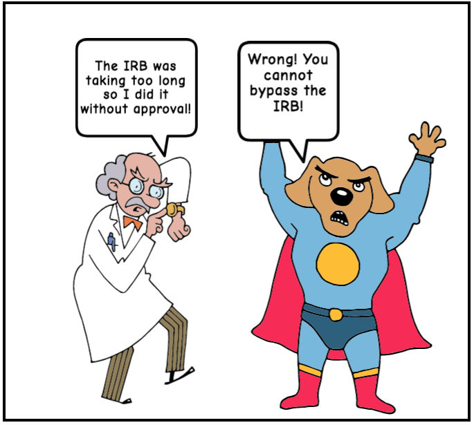

[<<< Previous](introduction.md) | [Next >>>](belmont.md)

# Ethics from the standpoint of the institution

We are scholars, so first things first: understanding any institutional compliance requirements you may need to fullfil to be permitted to do your project or research. Note that this section is primarily focused on institutional compliance in the United States, and emphasizes the perspective of social science researchers, who most frequently contend with Institutional Review Boards (IRBs). While humanities researchers often do not have to engage with IRB when working within their discipline, these considerations may also become relevant when creating certain kinds of digital projects.

Before delving into a deeper discussion of ethics beyond compliance, this first section of the workshop will address:

- The Belmont Report and Institutional Review Board (IRB)—a brief history of them and their intentions *their core principals may be useful to think through even if you are free to skip the logistical hassle of applying for IRB!*
- How to know if you will need to get IRB approval  

Source: This comic was created at [MakeBeliefsComix.com]((https://www.makebeliefscomix.com/). Create your own for free [here](https://www.makebeliefscomix.com/).

[<<< Previous](introduction.md) | [Next >>>](belmont.md)
